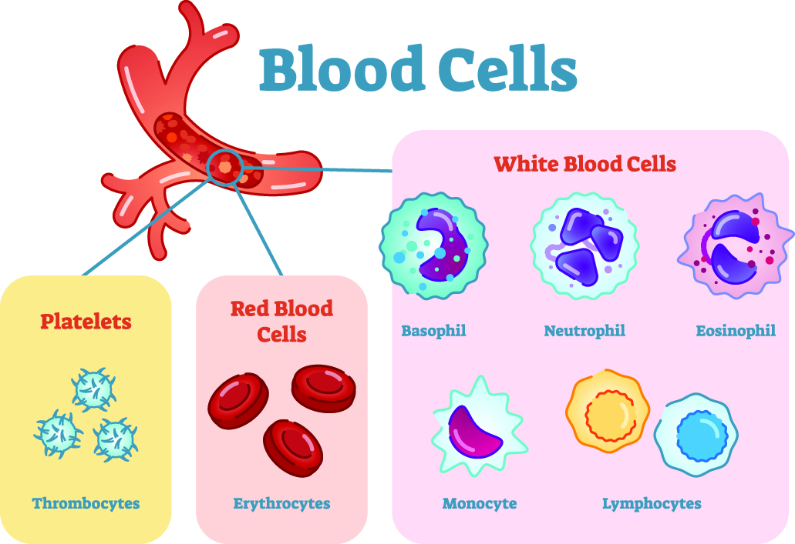
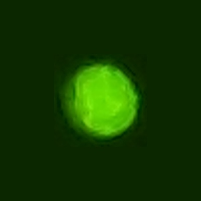

# NABZ GROUP
## CELL COUNTER

segmentation and classification and counting the cells in blood

   1-red blood cell
   
   2-white blood cell
   
   3-platelet
                             
                             

 
  

for medicl application , blood cells have a huge information about the diseases
 
 
 
 
