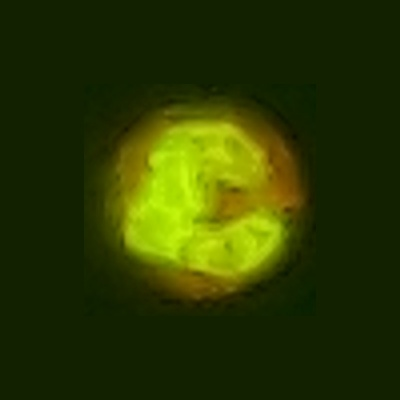
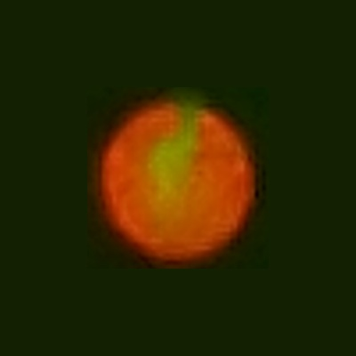

# NABZ GROUP
## CELL COUNTER

segmentation and classification and counting the cells in blood

   1-red blood cell
   
   2-white blood cell
   
   3-platelet
                             
                             
### blood cells

                      blood cells

for medicl application , blood cells have a huge information about the diseases

### esotrophil

 
### lamphocyte
 

 
### monocyte
 

### neutrophile
 

### basophill
 

